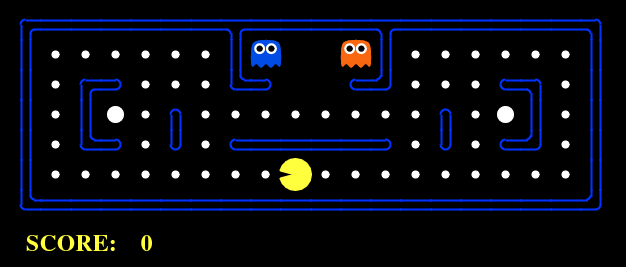

<h1 align="center">Hello, I'm Ezequiel Magalhaes 👋</h1>
<h3 align="center">An assiduous student of programming</h3>
 

  <a href="https://github.com/EzequielMagalhaes">
  
  

<h3 align="left">Languages and Tools:</h3>

 
  
  
  
  
  
  
  
  
  
  
  
  <!--  -->
  <!--  -->
  
  
  <!-- PostgreeSQL  -->
  
  <!-- GITLAB  --> 
  
  
  <!-- LINUX  -->

  
##
<h3 align="left">Connect with me:</h3>

 
  
  

 

<h1> About me </h1> 
<h3> 📚 Computer Science - UDF </h3>

### 💻 Programming languages:
- Java
- Javascript
- Typescript
- NodeJs
- ReactJs
- VueJs
- Python

### 👾 Skills:
- Application development with Java.

- Web development with Javascript and Bootstrap. 
  * Knowledge in NodeJs.
  * Knowledge in Typescript
  * Knowledge in ReactJs framework.
    - Vite
    - CRA
  * Knowledge in VueJs framework.
    - Vuetify
    - Vuex
    - Vue Router
- Knowledge of relational and non-relational databases.
  * MySQL
  * MongoDB

### ⚡ Next Goals:
- Software development internship.
- Improve my knowledge and master my skills in Java.
- In the future work with fullstack development using Java and JavaScript.

### 📜 My history:
- I'm Ezequiel, since I was a little boy I've been very curious and eager to learn more about this world of technology that covers many areas.
- I'm a computer science student, currently in my seventh semester. Where I had contact with some programming languages.
- I'm currently studying to improve my knowledge in programming languages and my programming logic.

### 📫 Contact:
  - Email: zekiel.dev@gmail.com
 
 
<!--*CONTADOR DE VIEWS DO PERFIL*
  
 

<!--
*JOGO DO PACMAN*

  

**EzequielMagalhaes/EzequielMagalhaes** is a ✨ _special_ ✨ repository because its `README.md` (this file) appears on your GitHub profile.
Here are some ideas to get you started:
- 🔭 I’m currently working on ...
- 🌱 I’m currently learning ...
- 👯 I’m looking to collaborate on ...
- 🤔 I’m looking for help with ...
- 💬 Ask me about ...
- 📫 How to reach me: ...
- 😄 Pronouns: ...
- ⚡ Fun fact: ...
 -->
